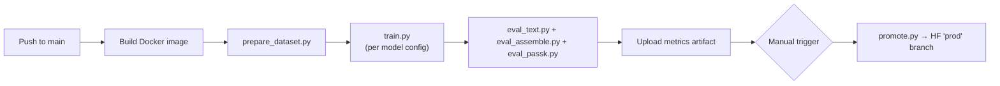

# Rizz-V — RV32IM Assembly LLM Pipeline

Automated pipeline that **fine-tunes multiple Hugging Face base models** on
RISC-V (RV32IM) assembly, evaluates them fairly with simulator-free metrics,
and publishes the best model to Hugging Face Hub under a stable `prod` alias.

> [!TIP]
> A brand-new contributor can run the full MVP pipeline on a small dataset
> **in ≈ 30 minutes** using only GitHub Actions — no local GPU required.

---

## Table of Contents

1. [Prerequisites](#prerequisites)
2. [Repository Layout](#repository-layout)
3. [Dataset Preparation](#dataset-preparation)
4. [Training](#training)
5. [Evaluation](#evaluation)
6. [Running the Full Pipeline in CI](#running-the-full-pipeline-in-ci)
7. [Running Locally (Optional)](#running-locally-optional)
8. [Adding a New Base-Model Experiment](#adding-a-new-base-model-experiment)
9. [Model Registry & Promotion to Prod](#model-registry--promotion-to-prod)
10. [Shared Token & Special-Symbol Definitions](#shared-token--special-symbol-definitions)
11. [Breaking-Change Policy](#breaking-change-policy)

---

## Prerequisites

| Requirement | Where it runs | Notes |
|---|---|---|
| **Docker** | CI runner / local | The `Dockerfile` bundles Python deps + RISC-V GNU toolchain (`riscv64-unknown-elf-gcc`, `rv32im/ilp32`). |
| **GitHub Actions** | CI | Workflows in `.github/workflows/` orchestrate build → train → eval → promote. |
| **Hugging Face Hub token** | CI secret `HF_TOKEN` | Write-access token for pushing models. Set it in repo **Settings → Secrets**. |
| **Python ≥ 3.10** | inside Docker | Only needed if running locally outside Docker. |

**You do NOT need** a local GPU, RISC-V simulator, or any toolchain installed
on your machine.  Everything runs inside the Docker image or on CI.

---

## Repository Layout

```
Rizz-V_AI-Enable/
├── configs/
│   ├── dataset.yaml          # Shared tokens, split ratios, mode weights
│   ├── model_codegen350m.yaml
│   ├── model_tinyllama.yaml
│   └── model_starcoder2_3b.yaml
├── scripts/
│   ├── prepare_dataset.py    # .S normalizer + JSONL builder
│   ├── train.py              # Model-agnostic fine-tuning
│   ├── eval_text.py          # Perplexity, token-acc, opcode-acc
│   ├── eval_assemble.py      # Assemble-in-context (GCC rv32im)
│   ├── eval_passk.py         # pass@k with optional ABI-lint
│   └── promote.py            # Push best model to HF "prod" branch
├── data/
│   ├── raw/                  # Raw .S files (one per file)
│   ├── normalized/           # After normalization
│   └── splits/               # train.jsonl, val.jsonl, test.jsonl
├── docker/
│   └── Dockerfile
├── .github/workflows/
│   ├── train.yml
│   ├── eval.yml
│   └── promote.yml
├── docs/
│   └── EXPERIMENTS.md
├── rizz-v/                   # VS Code extension (consumer)
├── main.py                   # FastAPI inference server
├── requirements.txt
└── README.md                 # ← you are here
```

---

## Dataset Preparation

### Overview

Raw `.S` files are **normalized** (comments stripped, labels lowered,
pseudo-ops expanded) and then converted to a JSONL dataset supporting four
generation modes: **causal**, **FIM** (fill-in-the-middle), **block
completion**, and **function-level generation**.

### Shared Token Definitions

All special tokens are defined once in [`configs/dataset.yaml`](configs/dataset.yaml):

```yaml
# configs/dataset.yaml
special_tokens:
  fim_prefix:  "<fim_prefix>"
  fim_middle:  "<fim_middle>"
  fim_suffix:  "<fim_suffix>"
  func_start:  "<func>"
  func_end:    "</func>"
  block_start: "<block>"
  block_end:   "</block>"

split:
  method: by_file          # No data leakage across splits
  seed:   42
  ratios: { train: 0.8, val: 0.1, test: 0.1 }

modes:
  weights: { causal: 0.4, fim: 0.3, block: 0.2, function: 0.1 }
```

> [!IMPORTANT]
> **Every agent and script** must read tokens from this single file.
> Never hard-code special tokens.Each script must log the token definitions at startup.

### CLI — Dataset Preparation

```bash
# Step 1 — Normalize raw .S files
python scripts/prepare_dataset.py normalize \
  --input-dir  data/raw/ \
  --output-dir data/normalized/ \
  --config     configs/dataset.yaml

# Step 2 — Build JSONL splits
python scripts/prepare_dataset.py build \
  --input-dir  data/normalized/ \
  --output-dir data/splits/ \
  --config     configs/dataset.yaml
```

#### Input / Output Schema

| Stage | Input | Output |
|---|---|---|
| `normalize` | `data/raw/*.S` (one function or test per file) | `data/normalized/*.S` (cleaned) |
| `build` | `data/normalized/*.S` + `configs/dataset.yaml` | `data/splits/{train,val,test}.jsonl` |

**JSONL record schema** (one JSON object per line):

```jsonc
{
  "text":      "<full token sequence>",   // always present
  "mode":      "causal|fim|block|function",
  "source_file": "add.S",                 // provenance
  "split":     "train",
  // FIM-specific (only when mode=fim):
  "prefix":    "...",
  "suffix":    "...",
  "middle":    "..."
}
```

---

## Training

Training is **model-agnostic**: the script reads a YAML config that specifies
the base model, LoRA/full-FT settings, hyperparameters, and output paths.

### Model Config Schema — `configs/model_*.yaml`

```yaml
# configs/model_codegen350m.yaml
model:
  name: "Salesforce/codegen-350M-multi"
  revision: "main"

training:
  method: lora              # "lora" | "full"
  lora_r: 16
  lora_alpha: 32
  epochs: 5
  batch_size: 8
  learning_rate: 2e-4
  warmup_ratio: 0.05
  fp16: true
  seed: 42                  # Reproducibility

dataset:
  config: configs/dataset.yaml
  max_seq_len: 512

output:
  dir: outputs/codegen350m/
  push_to_hub: true
  hub_repo: "GNbros/rizz-v-codegen350m"
```

### CLI — Training

```bash
python scripts/train.py \
  --config configs/model_codegen350m.yaml

# With overrides:
python scripts/train.py \
  --config configs/model_codegen350m.yaml \
  --override training.epochs=3 training.batch_size=4
```

#### Input / Output

| | Path | Format |
|---|---|---|
| **Input** | `data/splits/train.jsonl`, `data/splits/val.jsonl` | JSONL |
| **Input** | `configs/model_*.yaml` | YAML |
| **Output** | `outputs/<model>/checkpoint-*/` | HF model dir |
| **Output** | `outputs/<model>/train_metrics.json` | `{"loss": [...], "lr": [...], "epoch": N}` |

---

## Evaluation

Evaluation is **simulator-free** and fully deterministic.

> [!IMPORTANT]
> **Determinism rules** — every eval script must:
> 1. Accept `--seed` (default `42`) and set `torch`, `random`, `numpy` seeds.
> 2. Use `temperature=0.0, top_p=1.0, do_sample=False` for greedy decoding
>    by default (pass@k uses `temperature=0.8, top_p=0.95` for sampling).
> 3. Log seed + decoding params to the output JSON as `"eval_config": {...}`.

### 1. Text Metrics — `scripts/eval_text.py`

```bash
python scripts/eval_text.py \
  --model   outputs/codegen350m/checkpoint-best/ \
  --testset data/splits/test.jsonl \
  --output  outputs/codegen350m/metrics_text.json \
  --seed    42
```

**Output schema** (`metrics_text.json`):

```jsonc
{
  "eval_config": {
    "seed": 42,
    "temperature": 0.0,
    "top_p": 1.0,
    "do_sample": false
  },
  "perplexity":     2.48,
  "token_accuracy": 0.74,
  "opcode_accuracy": 0.81
}
```

### 2. Assemble-in-Context — `scripts/eval_assemble.py`

Rebuilds generated code into a `.S` file, compiles with `riscv64-unknown-elf-gcc -march=rv32im -mabi=ilp32`, and classifies stderr.

```bash
python scripts/eval_assemble.py \
  --model     outputs/codegen350m/checkpoint-best/ \
  --testset   data/splits/test.jsonl \
  --output    outputs/codegen350m/metrics_assemble.json \
  --gcc-path  riscv64-unknown-elf-gcc \
  --seed      42
```

**Output schema** (`metrics_assemble.json`):

```jsonc
{
  "eval_config": { "seed": 42, "gcc_flags": "-march=rv32im -mabi=ilp32" },
  "assemble_success_rate": 0.62,
  "total_samples":  200,
  "error_histogram": {
    "undefined_instruction": 34,
    "missing_label":         12,
    "syntax_error":          8
  }
}
```

### 3. pass@k — `scripts/eval_passk.py`

Generates `k` candidates per prompt, checks assembly and optional ABI-lint.

```bash
python scripts/eval_passk.py \
  --model      outputs/codegen350m/checkpoint-best/ \
  --testset    data/splits/test.jsonl \
  --output     outputs/codegen350m/metrics_passk.json \
  --k          1,5 \
  --abi-lint   \
  --seed       42 \
  --temperature 0.8 \
  --top-p      0.95
```

**Output schema** (`metrics_passk.json`):

```jsonc
{
  "eval_config": {
    "seed": 42,
    "temperature": 0.8,
    "top_p": 0.95,
    "do_sample": true,
    "abi_lint": true
  },
  "pass_at_1":          0.42,
  "pass_at_5":          0.58,
  "pass_at_1_abi_lint": 0.35,
  "pass_at_5_abi_lint": 0.49
}
```

**ABI-lint static checks** (heuristic, no simulator):

| Check | Rule |
|---|---|
| Stack restore | `sp` at function exit equals `sp` at entry |
| `ra` restore | `ra` is restored before `ret` |
| `s`-register save/restore | Every `s0`–`s11` stored in prologue is restored in epilogue |
| `ret` presence | Function body ends with `ret` or `jalr x0, ra` |

---

## Running the Full Pipeline in CI

### Quick Start (≈ 30 min with a small dataset)

1. **Fork** this repository.
2. Set **repository secret** `HF_TOKEN` with a Hugging Face write token.
3. Push a small set of `.S` files to `data/raw/` (≥ 20 files recommended).
4. Push to `main` — the `train.yml` workflow triggers automatically.

### CI Workflow Stages



#### `.github/workflows/train.yml` — Build + Train + Eval

Triggers on push to `main` or manually via `workflow_dispatch`.

| Job | Runs | Artifacts |
|---|---|---|
| `build` | Build & cache Docker image | — |
| `train` | Matrix over `configs/model_*.yaml` | `outputs/<model>/checkpoint-best/` |
| `eval` | All three eval scripts per model | `outputs/<model>/metrics_*.json` |

#### `.github/workflows/promote.yml` — Promote Best Model to Prod

Manual trigger (`workflow_dispatch`) with input `model_name`.

```yaml
# Example dispatch input
model_name: codegen350m
```

---

## Running Locally (Optional)

If you want to iterate on a laptop (CPU is fine for small-scale experiments):

```bash
# 1. Build Docker image
docker build -t rizz-v-pipeline -f docker/Dockerfile .

# 2. Run inside container
docker run --rm -it \
  -v $(pwd):/workspace \
  -e HF_TOKEN=$HF_TOKEN \
  rizz-v-pipeline bash

# Inside the container:
cd /workspace

# 3. Prepare dataset
python scripts/prepare_dataset.py normalize --input-dir data/raw/ --output-dir data/normalized/ --config configs/dataset.yaml
python scripts/prepare_dataset.py build    --input-dir data/normalized/ --output-dir data/splits/ --config configs/dataset.yaml

# 4. Train (small run)
python scripts/train.py --config configs/model_codegen350m.yaml \
  --override training.epochs=1 training.batch_size=2

# 5. Evaluate
python scripts/eval_text.py     --model outputs/codegen350m/checkpoint-best/ --testset data/splits/test.jsonl --output outputs/codegen350m/metrics_text.json
python scripts/eval_assemble.py --model outputs/codegen350m/checkpoint-best/ --testset data/splits/test.jsonl --output outputs/codegen350m/metrics_assemble.json
python scripts/eval_passk.py    --model outputs/codegen350m/checkpoint-best/ --testset data/splits/test.jsonl --output outputs/codegen350m/metrics_passk.json --k 1
```

---

## Adding a New Base-Model Experiment

Adding a new model requires **zero code changes** — only a new YAML config.

### Step-by-Step

1. **Create** `configs/model_<name>.yaml` by copying an existing config:
   ```bash
   cp configs/model_codegen350m.yaml configs/model_phi2.yaml
   ```

2. **Edit** the new file — change only the `model` section and tune
   hyperparameters if needed:
   ```yaml
   model:
     name: "microsoft/phi-2"
     revision: "main"

   training:
     method: lora
     lora_r: 16
     lora_alpha: 32
     epochs: 5
     batch_size: 4          # smaller for larger models
     learning_rate: 1e-4
     seed: 42

   output:
     dir: outputs/phi2/
     push_to_hub: true
     hub_repo: "GNbros/rizz-v-phi2"
   ```

3. **Push** to `main`. CI will automatically pick up any file matching
   `configs/model_*.yaml` and run it as a matrix job.

4. **Compare** metrics in the CI artifacts or on the HF Hub repo pages.

> [!NOTE]
> The CI matrix strategy uses:
> ```yaml
> strategy:
>   matrix:
>     config: [ "configs/model_*.yaml" ]  # glob expanded at runtime
> ```
> So new YAML files are picked up automatically.

### Checklist Before Adding a Model

- [ ] Does the tokenizer handle the special tokens in `configs/dataset.yaml`?
- [ ] Is `max_seq_len` ≤ the model's context window?
- [ ] Is `batch_size` feasible on the CI runner's memory?
- [ ] Did you set `seed: 42` for comparable results?

---

## Model Registry & Promotion to Prod

### How Versioning Works

Every CI training run pushes a **versioned branch** to HF Hub:

```
GNbros/rizz-v-codegen350m
  ├── main              ← latest code (may not be best)
  ├── run-2026-02-18    ← timestamped run branch
  └── prod              ← stable alias, used by downstream
```

### `scripts/promote.py` — Promote to Prod

```bash
python scripts/promote.py \
  --hub-repo GNbros/rizz-v-codegen350m \
  --source-branch run-2026-02-18 \
  --target-branch prod \
  --metrics-file outputs/codegen350m/metrics_passk.json \
  --min-pass-at-1 0.40
```

#### Input / Output

| | Description |
|---|---|
| **Input** | `--metrics-file` JSON (must have `pass_at_1 ≥ --min-pass-at-1`) |
| **Output** | HF Hub branch `prod` updated; promotion logged in `outputs/promotions.jsonl` |

**Promotion log schema** (`outputs/promotions.jsonl`):

```jsonc
{
  "timestamp":     "2026-02-18T20:00:00Z",
  "hub_repo":      "GNbros/rizz-v-codegen350m",
  "source_branch": "run-2026-02-18",
  "pass_at_1":     0.47,
  "abi_lint_pass":  0.42,
  "promoted":      true
}
```

### How Downstream Consumes `prod`

The VS Code extension and FastAPI server always load from the `prod` branch:

```python
# main.py — never changes when a new model is promoted
model = AutoModelForCausalLM.from_pretrained(
    "GNbros/rizz-v-codegen350m",
    revision="prod"
)
```

---

## Shared Token & Special-Symbol Definitions

> [!CAUTION]
> **Single source of truth**: [`configs/dataset.yaml`](configs/dataset.yaml).
>
> If you change a token — e.g. rename `<fim_prefix>` — you **must** add a
> **breaking-change note** in a PR comment and ensure all consumers
> (dataset builder, training, eval, VS Code extension) are updated atomically.

---

## Breaking-Change Policy

If any agent or contributor changes an **interface** that other components
depend on, they must:

1. Add a `> [!WARNING]` block in the PR description titled **"Breaking Change"**.
2. List affected file paths and the old → new schema.
3. Update this `README.md` and any relevant configs.

**Examples of interfaces**: JSONL schema fields, YAML config keys, CLI
argument names, special tokens, metrics JSON keys, HF Hub branch naming.

---

## License

See [LICENSE](LICENSE).