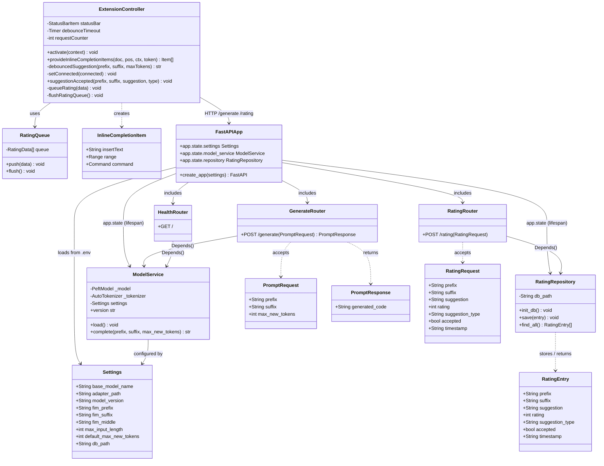
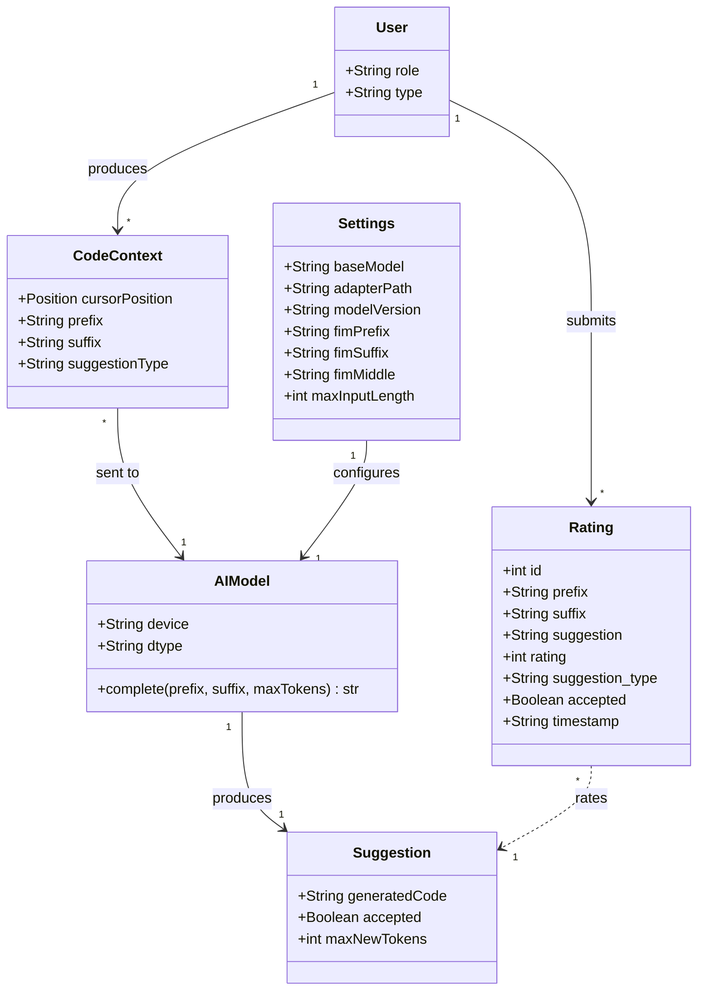

# Rizz-V Diagrams

## Class Diagram

```mermaid
classDiagram
    %% ── VS Code Extension ──────────────────────────────────────────────────
    class ExtensionController {
        -StatusBarItem statusBar
        -Timer debounceTimeout
        -int requestCounter
        +activate(context) void
        +provideInlineCompletionItems(doc, pos, ctx, token) Item[]
        -debouncedSuggestion(prefix, suffix, maxTokens) str
        -setConnected(connected) void
        +suggestionAccepted(prefix, suffix, suggestion, type) void
        -queueRating(data) void
        -flushRatingQueue() void
    }

    class RatingQueue {
        -RatingData[] queue
        +push(data) void
        +flush() void
    }

    class InlineCompletionItem {
        +String insertText
        +Range range
        +Command command
    }

    %% ── Backend: Config ────────────────────────────────────────────────────
    class Settings {
        +String base_model_name
        +String adapter_path
        +String model_version
        +String fim_prefix
        +String fim_suffix
        +String fim_middle
        +int max_input_length
        +int default_max_new_tokens
        +String db_path
    }

    %% ── Backend: Services ──────────────────────────────────────────────────
    class ModelService {
        -PeftModel _model
        -AutoTokenizer _tokenizer
        -Settings settings
        +load() void
        +complete(prefix, suffix, max_new_tokens) str
        +version str
    }

    class RatingRepository {
        -String db_path
        +init_db() void
        +save(entry) void
        +find_all() RatingEntry[]
    }

    class RatingEntry {
        +String prefix
        +String suffix
        +String suggestion
        +int rating
        +String suggestion_type
        +bool accepted
        +String timestamp
    }

    %% ── Backend: API ───────────────────────────────────────────────────────
    class FastAPIApp {
        +app.state.settings Settings
        +app.state.model_service ModelService
        +app.state.repository RatingRepository
        +create_app(settings) FastAPI
    }

    class HealthRouter {
        +GET /
    }

    class GenerateRouter {
        +POST /generate(PromptRequest) PromptResponse
    }

    class RatingRouter {
        +POST /rating(RatingRequest)
    }

    class PromptRequest {
        +String prefix
        +String suffix
        +int max_new_tokens
    }

    class PromptResponse {
        +String generated_code
    }

    class RatingRequest {
        +String prefix
        +String suffix
        +String suggestion
        +int rating
        +String suggestion_type
        +bool accepted
        +String timestamp
    }

    %% ── Relationships ──────────────────────────────────────────────────────
    ExtensionController --> RatingQueue        : uses
    ExtensionController ..> InlineCompletionItem : creates
    ExtensionController --> FastAPIApp         : HTTP /generate /rating

    FastAPIApp --> Settings                    : loads from .env
    FastAPIApp --> ModelService                : app.state (lifespan)
    FastAPIApp --> RatingRepository            : app.state (lifespan)
    FastAPIApp --> HealthRouter                : includes
    FastAPIApp --> GenerateRouter              : includes
    FastAPIApp --> RatingRouter                : includes

    ModelService --> Settings                  : configured by
    RatingRepository ..> RatingEntry           : stores / returns

    GenerateRouter ..> PromptRequest           : accepts
    GenerateRouter ..> PromptResponse          : returns
    GenerateRouter --> ModelService            : Depends()
    RatingRouter ..> RatingRequest             : accepts
    RatingRouter --> RatingRepository          : Depends()
    HealthRouter --> ModelService              : Depends()
```

---

## Domain Model

```mermaid
classDiagram
    class User {
        +String role
        +String type
    }

    class CodeContext {
        +Position cursorPosition
        +String prefix
        +String suffix
        +String suggestionType
    }

    class Settings {
        +String baseModel
        +String adapterPath
        +String modelVersion
        +String fimPrefix
        +String fimSuffix
        +String fimMiddle
        +int maxInputLength
    }

    class AIModel {
        +String device
        +String dtype
        +complete(prefix, suffix, maxTokens) str
    }

    class Suggestion {
        +String generatedCode
        +Boolean accepted
        +int maxNewTokens
    }

    class Rating {
        +int id
        +String prefix
        +String suffix
        +String suggestion
        +int rating
        +String suggestion_type
        +Boolean accepted
        +String timestamp
    }

    User "1" --> "*" CodeContext   : produces
    User "1" --> "*" Rating        : submits
    CodeContext "*" --> "1" AIModel : sent to
    Settings "1" --> "1" AIModel   : configures
    AIModel "1" --> "1" Suggestion : produces
    Rating "*" ..> "1" Suggestion  : rates
```
